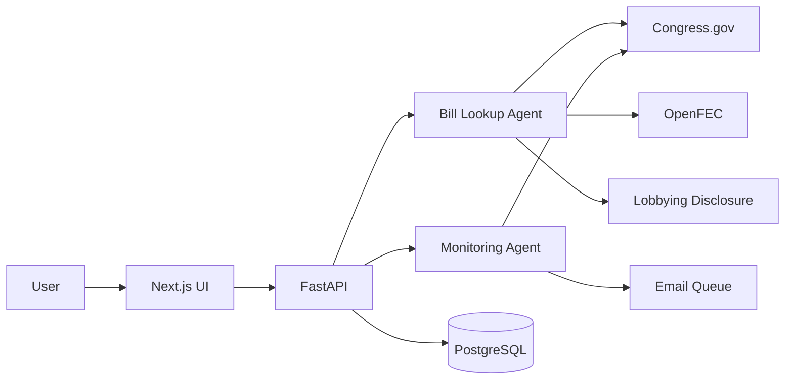

# Architecture Overview

Congress For Normal People is split into four layers:

1. **Interface layer**: Next.js renders the bill lookup and monitoring dashboard.
2. **Application layer**: FastAPI exposes workflow endpoints and persistence-backed monitoring views.
3. **Agent layer**: LangGraph workflows coordinate retrieval, enrichment, analysis, and notification payload generation.
4. **Integration layer**: Provider clients isolate Congress.gov, OpenFEC, and lobbying disclosure APIs.

## Components

- `apps/web`: Browser UI optimized for demos and repeated monitoring workflows.
- `apps/api`: REST API, CORS, startup schema creation, and use-case orchestration.
- `packages/agents`: Independent bill lookup and bill monitoring workflows.
- `packages/ingestion`: Swappable provider classes with deterministic demo fallbacks.
- `packages/db`: SQLAlchemy ORM models and sessions.
- `packages/jobs`: Polling and digest construction jobs.
- `packages/notifications`: Email queue boundary.

## Data Flow

## Production Evolution

The current repository keeps local setup simple by creating tables on API startup. In production, add Alembic migrations, a durable queue, authenticated users, encrypted secrets, and source-level citation storage for every generated claim.
